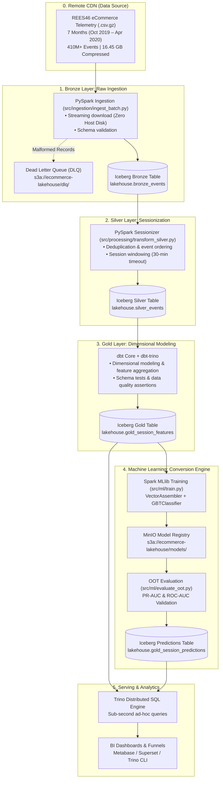

# End-to-End E-Commerce Telemetry Lakehouse & Distributed ML Engine

A production-grade, GitOps-ready Open Data Lakehouse and Distributed Machine Learning platform built with **PySpark 3.5.1**, **Apache Iceberg**, **MinIO (S3A)**, **Trino**, **dbt**, and **Spark MLlib**, deployed on **Dokploy** (Docker PaaS on VPS).

---

## 1. Architecture Overview

The system ingests and processes high-throughput e-commerce clickstream telemetry (~410M+ events, 16.45 GB compressed across 7 months, Oct 2019 – Apr 2020) through an ACID-compliant Medallion Lakehouse architecture, training distributed ML models for real-time session purchase conversion scoring.



---

## 2. Medallion Lakehouse Flow

| Layer | Engine | Format / Storage | Description |
| :--- | :--- | :--- | :--- |
| **Bronze** | PySpark 3.5.1 | Apache Iceberg on MinIO | Raw clickstream events ingested directly from remote streams. Enforces `RAW_EVENT_SCHEMA`, catches malformed rows into DLQ, and partitions by `days(event_timestamp)`. |
| **Silver** | PySpark 3.5.1 | Apache Iceberg on MinIO | Cleaned, deduplicated, and sessionized events. Defines user session windows, event order sequences, and removes crawler/bot noise. |
| **Gold** | dbt + Trino | Apache Iceberg on MinIO | Business-level aggregations and session-level feature store (`user_session`, `view_count`, `cart_count`, `duration_seconds`, `is_purchased`). |
| **ML Scoring** | Spark MLlib | Apache Iceberg on MinIO | Distributed `GBTClassifier` scoring session purchase conversion probabilities (`gold_session_predictions`), queried instantly by Trino for marketing funnels. |

---

## 3. Repository Layout

```text
.
|-- .env.example
|-- .gitignore
|-- .python-version
|-- Makefile
|-- README.md
|-- pyproject.toml
|-- uv.lock
|-- requirements.txt
|-- docker-compose.yml
|-- docker/
|   |-- spark/
|   |   `-- Dockerfile
|   |-- trino/
|   |   `-- Dockerfile
|   `-- app/
|       `-- Dockerfile
|-- configs/
|   |-- spark_config.yaml
|   |-- lakehouse_config.yaml
|   `-- ml_config.yaml
|-- terraform/
|   |-- main.tf
|   |-- variables.tf
|   |-- outputs.tf
|   `-- providers.tf
|-- dbt_ecommerce/
|   |-- dbt_project.yml
|   |-- packages.yml
|   |-- profiles.yml.template
|   |-- models/
|   |   |-- staging/
|   |   |-- intermediate/
|   |   `-- marts/
|   `-- tests/
|-- src/
|   |-- __init__.py
|   |-- common/
|   |   |-- __init__.py
|   |   |-- logger.py
|   |   `-- spark_session.py
|   |-- ingestion/
|   |   |-- __init__.py
|   |   |-- schemas.py
|   |   `-- ingest_batch.py
|   |-- processing/
|   |   |-- __init__.py
|   |   |-- sessionizer.py
|   |   `-- transform_silver.py
|   `-- ml/
|       |-- __init__.py
|       |-- feature_engineering.py
|       |-- train.py
|       `-- evaluate_oot.py
`-- tests/
    |-- conftest.py
    |-- test_schemas.py
    |-- test_sessionizer.py
    `-- test_ml_pipeline.py
```

---

## 4. Ingestion Engine CLI Specifications

The batch ingestion engine (`src/ingestion/ingest_batch.py`) streams remote files directly to ephemeral scratch space, routes malformed records to MinIO DLQ, and commits clean records into an Iceberg table partitioned by day (`days(event_timestamp)`).

### CLI Parameters:
* `--url`: Remote URL(s) to `.csv.gz` files (repeatable flag: pass multiple times).
* `--table-name`: Target Iceberg table (default: `lakehouse.bronze_events`).
* `--warehouse-path`: MinIO S3A destination (default: `s3a://ecommerce-lakehouse/iceberg`).
* `--dlq-dir`: S3A path for dead letters (default: `s3a://ecommerce-lakehouse/dlq`).

### Local Execution (via `uv`):
```bash
uv run python -m src.ingestion.ingest_batch \
  --url https://example.com/data/2019-Oct.csv.gz \
  --url https://example.com/data/2019-Nov.csv.gz \
  --table-name lakehouse.bronze_events \
  --warehouse-path s3a://ecommerce-lakehouse/iceberg \
  --dlq-dir s3a://ecommerce-lakehouse/dlq
```

### Docker Execution (Dokploy / Compose):
```bash
docker run --rm \
  --network lakehouse-net \
  -e MINIO_ENDPOINT=http://minio:9000 \
  -e MINIO_ACCESS_KEY=minioadmin \
  -e MINIO_SECRET_KEY=minioadmin \
  ecommerce-ingestion:latest \
  --url https://example.com/data/2019-Oct.csv.gz \
  --table-name lakehouse.bronze_events
```
