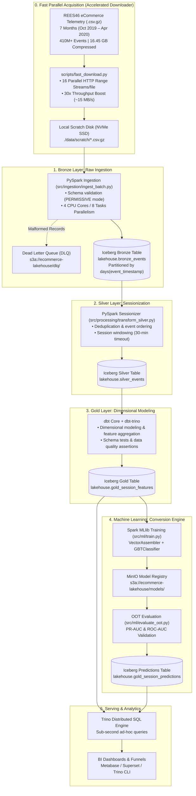

# End-to-End E-Commerce Telemetry Lakehouse & Distributed ML Engine

A production-grade, GitOps-ready Open Data Lakehouse and Distributed Machine Learning platform built with **PySpark 3.5.1**, **Apache Iceberg**, **MinIO (S3A)**, **Trino**, **dbt**, and **Spark MLlib**, deployed on **Dokploy** (Docker PaaS on VPS).

---

## 1. Architecture Overview

The system ingests and processes high-throughput e-commerce clickstream telemetry (~410M+ events, 16.45 GB compressed across 7 months, Oct 2019 – Apr 2020) through an ACID-compliant Medallion Lakehouse architecture, training distributed ML models for real-time session purchase conversion scoring.


```mermaid
flowchart TD
    subgraph Stage0["0. Fast Parallel Acquisition (Accelerated Downloader)"]
        CDN["REES46 eCommerce Telemetry (.csv.gz)<br/>7 Months (Oct 2019 – Apr 2020)<br/>410M+ Events | 16.45 GB Compressed"]
        DL["scripts/fast_download.py<br/>• 16 Parallel HTTP Range Streams/file<br/>• 30x Throughput Boost (~15 MB/s)"]
        Scratch["Local Scratch Disk (NVMe SSD)<br/>./data/scratch/*.csv.gz"]
        CDN --> DL --> Scratch
    end

    subgraph Stage1["1. Bronze Layer: Raw Ingestion"]
        Ingest["PySpark Ingestion (src/ingestion/ingest_batch.py)<br/>• Schema validation (PERMISSIVE mode)<br/>• 4 CPU Cores / 8 Tasks Parallelism"]
        DLQ["Dead Letter Queue (DLQ)<br/>s3a://ecommerce-lakehouse/dlq/"]
        Bronze[("Iceberg Bronze Table<br/>lakehouse.bronze_events<br/>Partitioned by days(event_timestamp)")]
        Scratch --> Ingest
        Ingest --> Bronze
        Ingest -.->|Malformed Records| DLQ
    end

    subgraph Stage2["2. Silver Layer: Sessionization"]
        Sess["PySpark Sessionizer (src/processing/transform_silver.py)<br/>• Deduplication & event ordering<br/>• Session windowing (30-min timeout)"]
        Silver[("Iceberg Silver Table<br/>lakehouse.silver_events")]
        Bronze --> Sess --> Silver
    end

    subgraph Stage3["3. Gold Layer: Dimensional Modeling"]
        DBT["dbt Core + dbt-trino<br/>• Dimensional modeling & feature aggregation<br/>• Schema tests & data quality assertions"]
        Gold[("Iceberg Gold Table<br/>lakehouse.gold_session_features")]
        Silver --> DBT --> Gold
    end

    subgraph Stage4["4. Machine Learning: Conversion Engine"]
        Train["Spark MLlib Training (src/ml/train.py)<br/>VectorAssembler + GBTClassifier"]
        ModelStore["MinIO Model Registry<br/>s3a://ecommerce-lakehouse/models/"]
        OOT["OOT Evaluation (src/ml/evaluate_oot.py)<br/>PR-AUC & ROC-AUC Validation"]
        Predictions[("Iceberg Predictions Table<br/>lakehouse.gold_session_predictions")]
        
        Gold --> Train --> ModelStore
        ModelStore --> OOT --> Predictions
    end

    subgraph Stage5["5. Serving & Analytics"]
        Trino["Trino Distributed SQL Engine<br/>Sub-second ad-hoc queries"]
        BI["BI Dashboards & Funnels<br/>Metabase / Superset / Trino CLI"]
        Gold --> Trino
        Predictions --> Trino
        Trino --> BI
    end
```

---

## 2. Medallion Lakehouse Flow

| Layer | Engine | Format / Storage | Description |
| :--- | :--- | :--- | :--- |
| **Ingestion Engine** | Python / Click | Local NVMe Scratch | High-speed multi-threaded range downloader (`scripts/fast_download.py`) splitting files into 16 concurrent chunk streams to bypass server throttling. |
| **Bronze** | PySpark 3.5.1 | Apache Iceberg v2 on MinIO | Schema-enforced raw clickstream events. Routes corrupt rows / negative prices / null user IDs into DLQ Snappy Parquet, partitioned by `days(event_timestamp)`. |
| **Silver** | PySpark 3.5.1 | Apache Iceberg v2 on MinIO | Cleaned, deduplicated, and sessionized events. Computes 30-minute inactivity session boundaries and event sequence numbers. |
| **Gold** | dbt + Trino | Apache Iceberg v2 on MinIO | Dimensional marts & session feature store (`user_session`, `view_count`, `cart_count`, `duration_seconds`, `is_purchased`). |
| **ML Scoring** | Spark MLlib | Apache Iceberg v2 on MinIO | Distributed `GBTClassifier` scoring session purchase conversion probabilities (`gold_session_predictions`), queried directly by Trino. |

---

## 3. Repository Layout

```text
.
|-- .env.example                # Lakehouse & MinIO environment template
|-- .gitignore                  # Git ignore rules (protects .env and data/)
|-- .python-version             # Python runtime specification
|-- Makefile                    # Automation & pipeline orchestration targets
|-- README.md                   # System documentation & architecture
|-- pyproject.toml              # Project dependencies & tool configurations
|-- uv.lock                     # Lockfile for deterministic environments
|-- requirements.txt            # Python requirements
|-- docker-compose.yml          # Containerized local Spark & App runner
|-- scripts/
|   |-- __init__.py
|   `-- fast_download.py        # 16-thread accelerated HTTP Range downloader
|-- docker/
|   |-- spark/
|   |   `-- Dockerfile
|   |-- trino/
|   |   `-- Dockerfile
|   `-- app/
|       `-- Dockerfile
|-- configs/
|   |-- spark_config.yaml
|   |-- lakehouse_config.yaml
|   `-- ml_config.yaml
|-- dbt_ecommerce/
|   |-- dbt_project.yml
|   |-- packages.yml
|   |-- profiles.yml.template
|   |-- models/
|   |   |-- staging/
|   |   |-- intermediate/
|   |   `-- marts/
|   `-- tests/
|-- src/
|   |-- __init__.py
|   |-- common/
|   |   |-- __init__.py
|   |   |-- logger.py
|   |   `-- spark_session.py
|   |-- ingestion/
|   |   |-- __init__.py
|   |   |-- schemas.py
|   |   `-- ingest_batch.py
|   |-- processing/
|   |   |-- __init__.py
|   |   |-- sessionizer.py
|   |   `-- transform_silver.py
|   `-- ml/
|       |-- __init__.py
|       |-- feature_engineering.py
|       |-- train.py
|       `-- evaluate_oot.py
`-- tests/
    |-- conftest.py
    |-- test_fast_download.py
    |-- test_schemas.py
    |-- test_sessionizer.py
    `-- test_ml_pipeline.py
```

---

## 4. Ingestion & Download CLI Specifications

### A. Accelerated Dataset Acquisition (`scripts/fast_download.py`)
Bypasses remote single-stream bandwidth throttling using 16 concurrent HTTP Range chunk workers per file with real-time ETA and transfer speed reporting.

```bash
# Download all 7 months (Oct 2019 – Apr 2020)
uv run python scripts/fast_download.py --all --output-dir ./data/scratch

# Or download the 5 remaining months (Dec 2019 – Apr 2020)
uv run python scripts/fast_download.py --all-remainders --output-dir ./data/scratch

# Or download a specific month with custom thread count
uv run python scripts/fast_download.py --url https://data.rees46.com/datasets/marketplace/2019-Dec.csv.gz --threads 16
```

### B. Batch Ingestion Engine (`src/ingestion/ingest_batch.py`)
Reads downloaded `.csv.gz` from local scratch (or remote streams), applies `RAW_EVENT_SCHEMA`, quarantines corrupt rows to MinIO DLQ, and commits clean data to Apache Iceberg `lakehouse.bronze_events` partitioned by day.

```bash
# Ingest downloaded local file into Iceberg Bronze
uv run python -m src.ingestion.ingest_batch \
  --source ./data/scratch/2019-Dec.csv.gz \
  --table-name lakehouse.bronze_events \
  --warehouse-path s3a://ecommerce-lakehouse/iceberg \
  --dlq-dir s3a://ecommerce-lakehouse/dlq
```

### C. Makefile Orchestration
```bash
# Download remainder datasets
make download-remainders

# Ingest single month
make ingest MONTH=2019-Dec

# Ingest all 7 months sequentially
make ingest-all

# Run Silver sessionization
make sessionize

# Run dbt transformations & tests
make dbt-run
make dbt-test

# Train ML conversion model & evaluate OOT
make train-ml
make eval-oot

# Execute full end-to-end pipeline
make pipeline
```
